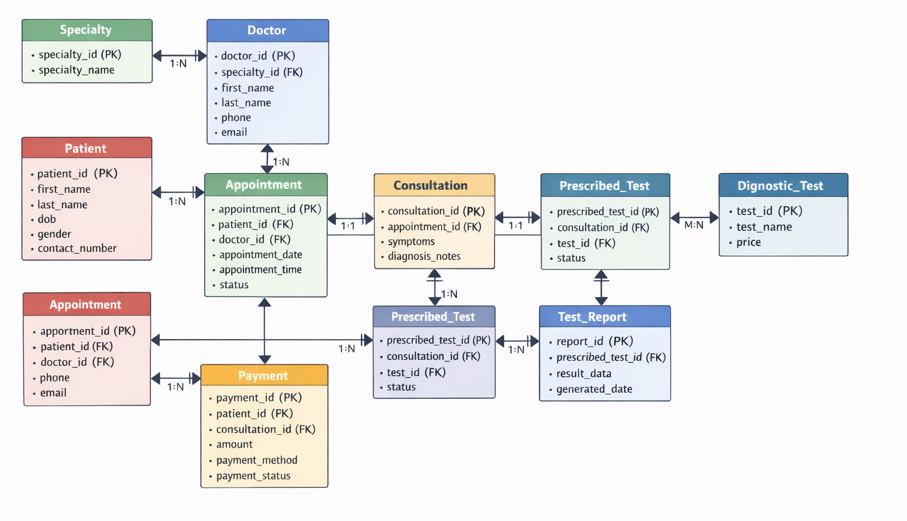

# Clinic Appointment and Diagnostics Platform

A clean and scalable **ER Diagram design** for a modern clinic management system.

## Overview

This project models the core database structure of a clinic that handles:

- patient registration
- doctor and specialty management
- appointment booking
- consultation/visit tracking
- diagnostic test ordering
- report generation
- payment recording

The design follows the real clinic workflow from **appointment → consultation → diagnostics → report → payment**.

---

## Objective

The main goal of this ER diagram is to represent how a clinic stores and connects its data in a simple, normalized, and practical way.

It helps answer questions such as:

- Which patient booked which appointment?
- Which doctor handled the visit?
- What is the status of the appointment?
- Did the appointment lead to a consultation?
- Which tests were prescribed during the consultation?
- What report was generated for each test?
- How was the payment recorded?

---

## Core Workflow

1. A patient books an appointment with a doctor.
2. The appointment may or may not turn into a consultation.
3. During the consultation, the doctor may prescribe one or more diagnostic tests.
4. Each test order can generate a report later.
5. Payment is recorded against the relevant visit.

---

## Entities and Attributes

### 1. Patient
Stores patient details.

- `patient_id` (PK)
- `full_name`
- `email`
- `phone`
- `date_of_birth`
- `sex`
- `created_at`

### 2. Doctor
Stores doctor details.

- `doctor_id` (PK)
- `full_name`
- `email`
- `phone`
- `license_no`
- `department`
- `is_active`
- `created_at`

### 3. Specialty
Stores the medical specialty list.

- `specialty_id` (PK)
- `name`
- `description`

### 4. Doctor_Specialty
Connects doctors with specialties.

- `doctor_specialty_id` (PK)
- `doctor_id` (FK)
- `specialty_id` (FK)

### 5. Appointment
Stores booking information.

- `appointment_id` (PK)
- `patient_id` (FK)
- `doctor_id` (FK)
- `scheduled_start`
- `scheduled_end`
- `status`
- `reason_for_visit`
- `booked_at`

### 6. Consultation
Stores details of the actual visit.

- `consultation_id` (PK)
- `appointment_id` (FK, optional)
- `patient_id` (FK)
- `doctor_id` (FK)
- `check_in_time`
- `start_time`
- `end_time`
- `diagnosis_summary`
- `notes`
- `status`

### 7. Diagnostic_Test
Stores the available test catalog.

- `test_id` (PK)
- `name`
- `category`
- `description`
- `base_price_amount`
- `base_price_currency`
- `is_active`

### 8. Test_Order
Stores tests prescribed during a consultation.

- `test_order_id` (PK)
- `consultation_id` (FK)
- `test_id` (FK)
- `ordered_at`
- `priority`
- `status`
- `instructions`

### 9. Test_Report
Stores report details for each ordered test.

- `report_id` (PK)
- `test_order_id` (FK)
- `generated_at`
- `report_status`
- `result_summary`
- `report_url`

### 10. Payment
Stores payment details.

- `payment_id` (PK)
- `consultation_id` (FK)
- `appointment_id` (FK, optional)
- `amount`
- `currency`
- `provider`
- `provider_ref`
- `paid_at`
- `status`

---

## Relationships

- A **Patient** can book many **Appointments**
- A **Doctor** can attend many **Appointments**
- An **Appointment** may result in **zero or one Consultation**
- A **Patient** can have many **Consultations**
- A **Doctor** can conduct many **Consultations**
- A **Consultation** can have many **Test Orders**
- A **Diagnostic Test** can appear in many **Test Orders**
- Each **Test Order** can generate one **Test Report**
- A **Consultation** can have related **Payments**
- A **Doctor** can have multiple **Specialties** through `Doctor_Specialty`

---

## Key Design Decisions

### Appointment and Consultation are separate
An appointment is only a booking. A consultation happens only when the patient actually meets the doctor. This keeps the model accurate for cancelled and no-show appointments.

### Walk-in support
A consultation can exist without a linked appointment, which makes the design flexible for walk-in visits.

### Test ordering is normalized
Tests are linked through `Test_Order` so that one consultation can have multiple diagnostic tests without duplication.

### Flexible payment handling
Payments can be connected to a consultation and optionally to an appointment, depending on how the clinic manages billing.

### Specialty is normalized
Instead of storing specialty as plain text inside the doctor table, it is handled separately for cleaner design and better scalability.

---

## ER Diagram

> Replace the image path below with your exported diagram file inside the repository.



---

## Suggested Submission Files

A good submission structure may look like this:

```text
Clinic-Appointment-and-Diagnostics-Platform/
├── README.md
└── clinic-er-diagram.png
